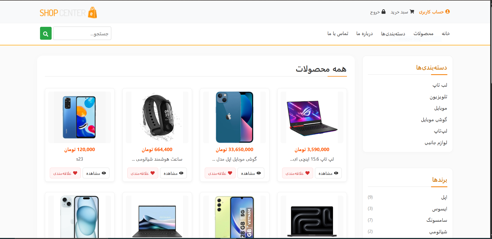
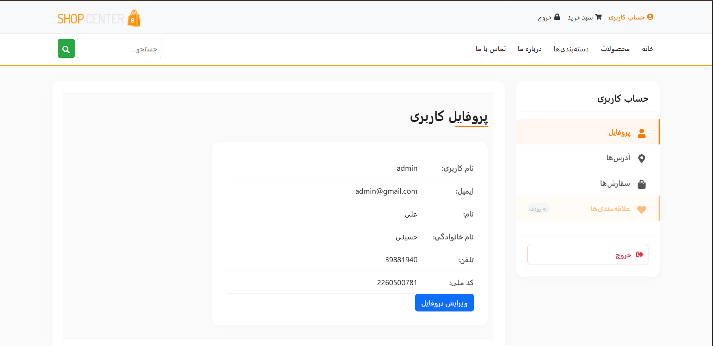
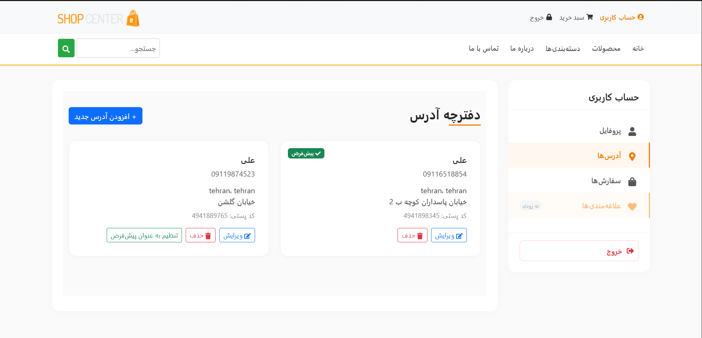
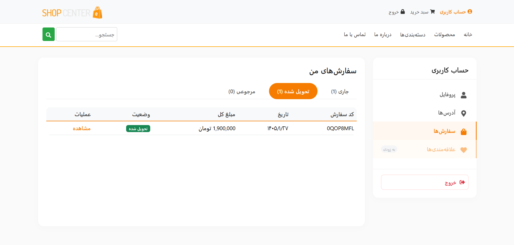
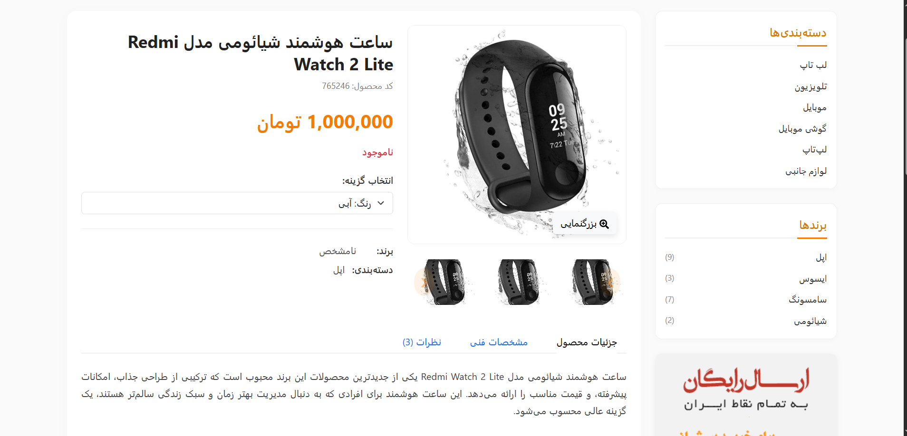
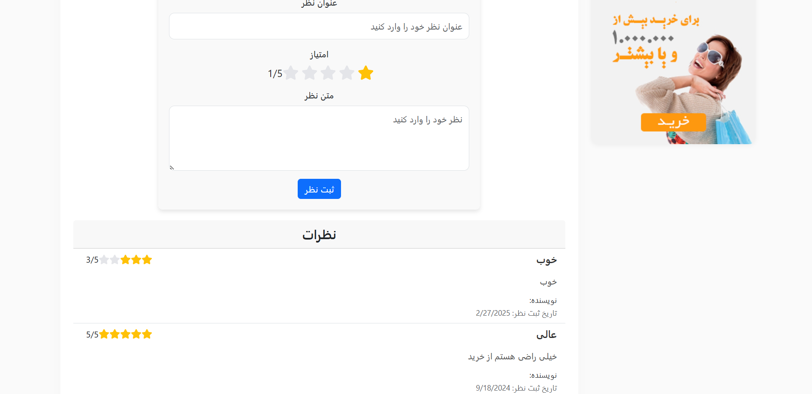
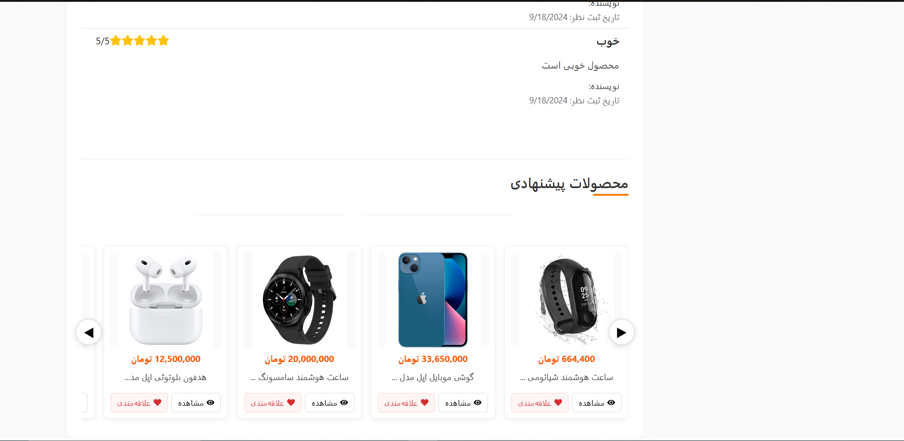
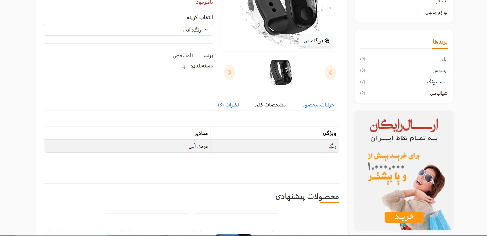

# Full-Stack Ecommerce Project

A modern, containerized Ecommerce platform featuring a **Django REST Framework** backend and a **React.js** frontend, orchestrated with **Docker** and **Nginx**.

## 📸 Product Preview
Below are the sample product images included in this project (`/images` directory):

| Product 1 | Product 2 | Product 3 | Product 4 |
|:---:|:---:|:---:|:---:|
|  |  |  |  |
| **Product 5** | **Product 6** | **Product 7** | **Product 8** |
|  |  |  |  |

---

## 🏗 Project Architecture

This project is divided into three main services:
- **Frontend**: React application (Single Page Application).
- **Backend**: Django API with Gunicorn production server.
- **Reverse Proxy**: Nginx handling requests and serving static/media files.
- **Database**: PostgreSQL for persistent data storage.

## 🚀 Getting Started

### Prerequisites
- [Docker](https://www.docker.com/)
- [Docker Compose](https://docs.docker.com/compose/)

### Installation & Setup

1. **Clone the Repository:**
```bash
   git clone https://github.com/alivssut/ecommerce.git
   cd ecommerce
   
